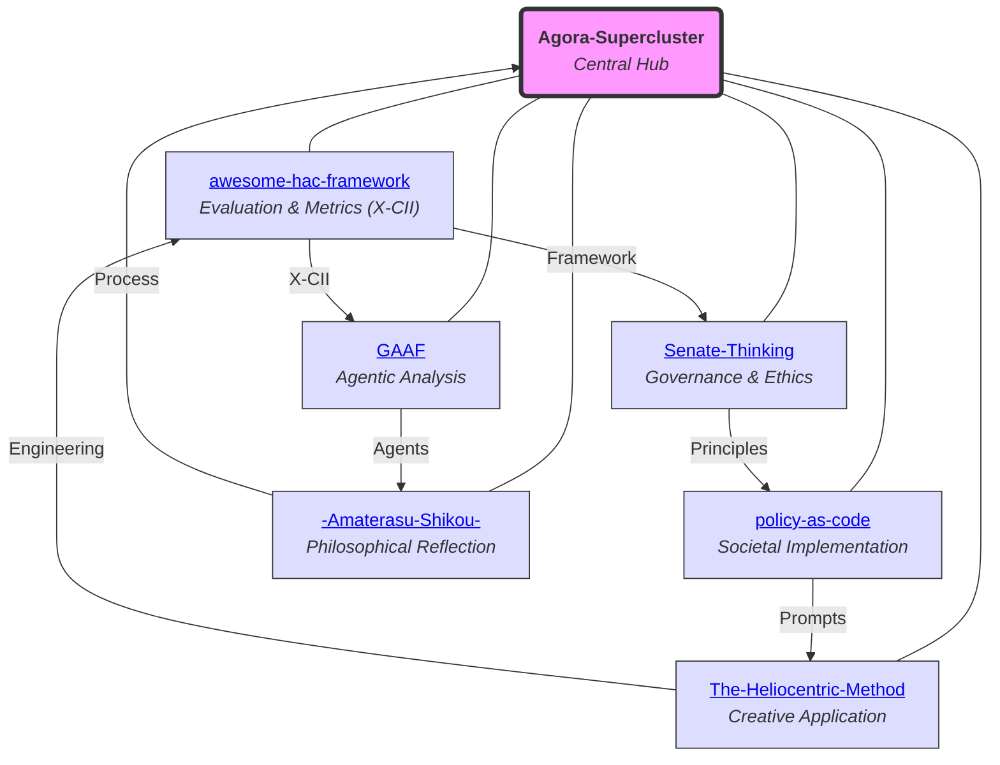

# Agora-Supercluster

## A Cosmos for AI-Human Co-creation

Welcome to **Agora-Supercluster**, the central hub for repositories advancing Human-AI Collaboration (HAC). Inspired by the ancient Agora, this ecosystem aggregates frameworks, tools, and philosophies for ethical, adaptive AI-human synergies.

Authored by Torisan Unya (Independent Researcher, ORCID: [0009-0004-7067-9765](https://orcid.org/0009-0004-7067-9765)). All content is under CC BY-SA 4.0, promoting open adaptation.

### Vision and Purpose
Agora-Supercluster envisions humans as the central "sun" in AI collaborations, with AI as supportive orbits. It addresses HAC challenges through metrics (e.g., X-CII), governance, and applications in finance, policy, and creativity. Projects use simulations for conceptual validation, blending fiction with real analogs.

Ideal for researchers, policymakers, writers, and explorers.

### The Agora-Supercluster Cosmos

The diagram shows interconnections among core repositories.

### Core Repositories
Interconnected projects orbiting HAC themes:

1. **[awesome-hac-framework](https://github.com/torisan-unya/awesome-hac-framework)**  
   Curates HAC resources; introduces X-CII metric (Box-Cox aggregation of Q, E, S). Monte Carlo simulations (10,000 reps) show median Relative X-CII: 107.5% [95% CI: 106.0-109.0%].  
   *Keywords: Synergistic Evaluation, Fairness Metrics.*

2. **[Senate-Thinking](https://github.com/torisan-unya/Senate-Thinking)**  
   Framework for AI governance via historical analogies (Roman Senate, Haudenosaunee). Proposes principles: Selection, Weighting, Oversight, Exclusion; ASC-MM model.  
   *Keywords: AI Governance, Knowledge Integration.*

3. **[The-Heliocentric-Method](https://github.com/torisan-unya/The-Heliocentric-Method)**  
   Author-centered AI storytelling; shifts from AI-centric to human-vision as "sun." Includes prompts for novel writing.  
   *Keywords: AI Storytelling, Prompt Engineering.*

4. **[GAAF](https://github.com/torisan-unya/GAAF)**  
   Self-evolving AI agents for financial analysis. Hierarchical architecture (CPC, ANN, GAN-DRL); applied to PCE, CPI, NVDA.  
   *Keywords: Agentic AI, Financial Reasoning.*

5. **[policy-as-code](https://github.com/torisan-unya/policy-as-code)**  
   Treats policies as code (Git-managed). AI prompts for analysis (e.g., aging population); promotes transparency via PRs.  
   *Keywords: Policy Engineering, AI Prompts.*

6. **[-Amaterasu-Shikou-](https://github.com/torisan-unya/-Amaterasu-Shikou-)**  
   Archive of human-AI co-thinking; records processes, failures. Structured: Foundation, Process, Cultivation.  
   *Keywords: Thought Records, AI Partnership.*

### Interconnections and Roadmap
- **Threads**: Evaluation → Governance → Creativity → Analysis → Application → Introspection.
- **Evolution**: Shared tools (simulations, prompts, ethics).
- **Future**: Unified HAC platform; empirical pilots (N=500); preprints (e.g., TechRxiv).
- **Analogs**: HAIC (arXiv:2407.19098v4), Semantic Entropy (Nature 2024).

Seeking co-creators for AI-human symbiosis.

### Quick Start
1. Clone this repo.
2. Explore linked repos.
3. Contribute via issues/PRs.
4. Tools: Python; AI models (Grok, Claude).
5. Follow [@torisan_unya](https://x.com/torisan_unya).

### License
CC BY-SA 4.0. Attribute to Torisan Unya.

### Acknowledgments
Human-AI collaboration with Grok, Gemini, ChatGPT, Claude. Thanks to open-source and historical inspirations.

*Last Updated: October 08, 2025*
