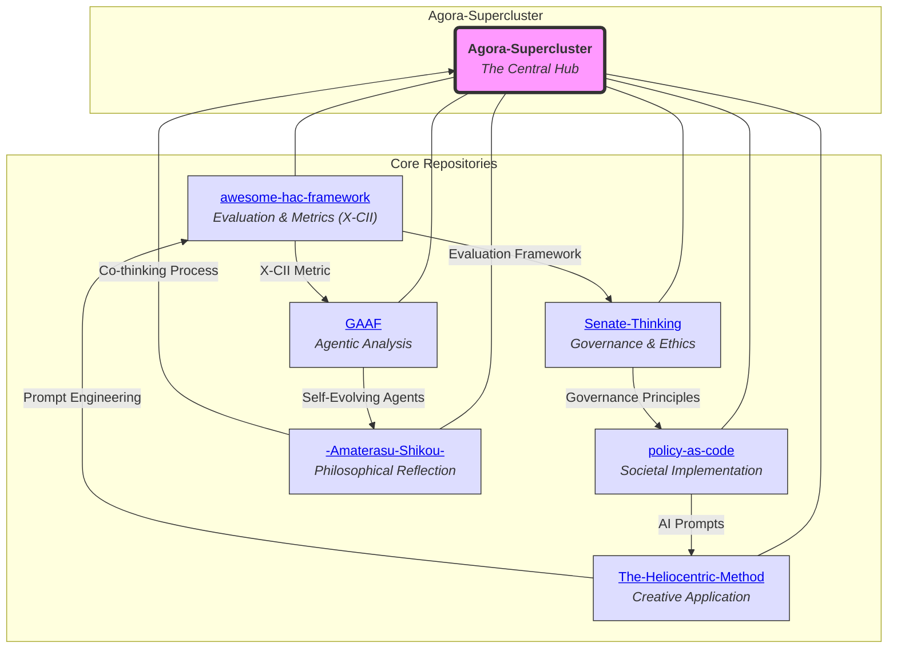

# Agora-Supercluster

## A Cosmos for AI-Human Co-creation

Welcome to **Agora-Supercluster**, the central hub and gateway for a constellation of repositories dedicated to exploring, advancing, and realizing synergistic Human-AI Collaboration (HAC). Inspired by the ancient Agora as a marketplace of ideas, this supercluster aggregates innovative frameworks, tools, methodologies, and philosophical reflections on AI-human co-creation.

Authored by Torisan Unya (Independent Researcher, ORCID: [0009-0004-7067-9765](https://orcid.org/0009-0004-7067-9765)), these projects form a unified cosmos where AI serves as a collaborative partner, not a dominant force—emphasizing ethical, adaptive, and creative synergies.

This repository acts as the "front door" to the ecosystem, providing overviews, interconnections, and entry points to the pinned repositories. All content is released under the Creative Commons Attribution-ShareAlike 4.0 International (CC BY-SA 4.0) license, encouraging open exploration, adaptation, and contributions while preventing exclusive appropriation.

### Vision and Purpose
In an era where AI reshapes knowledge, creativity, and decision-making, Agora-Supercluster envisions a "cosmos" for AI-human co-creation: a dynamic space where humans remain at the center (like the sun in a heliocentric model), and AI orbits as supportive agents, tools, and co-thinkers. Drawing from historical analogies (e.g., Roman Senate, Indigenous governance), philosophical precedents, and cutting-edge metrics (e.g., X-CII for synergistic evaluation), this supercluster addresses key challenges:
- Measuring and enhancing collaborative intelligence.
- Governing AI integration into human knowledge assemblies.
- Applying HAC to domains like finance, policy, storytelling, and personal reflection.
- Fostering ethical, fair, and robust systems through simulations, prompts, and self-evolving architectures.

The projects evolve iteratively, blending fictional explorations (as meta-exercises) with real-world analogs and prototypes. **This approach enables rapid, low-cost simulation of academic discourse and conceptual validation before engaging in large-scale empirical studies.** Whether you're an AI researcher, policymaker, creative writer, or curious explorer, start here to navigate the cluster.

### The Agora-Supercluster Cosmos

The relationships between these core projects form a dynamic intellectual ecosystem. The diagram below visualizes this interconnected cosmos, with the central hub providing access to each orbiting repository.

### Core Repositories in the Supercluster
Below is a curated list of the six foundational repositories, each representing a star in this cosmos. They interconnect: for example, X-CII metrics from `awesome-hac-framework` inform evaluations in `GAAF` and `Senate-Thinking`, while prompts from `policy-as-code` enhance creative processes in `The-Heliocentric-Method`.

1. **[awesome-hac-framework](https://github.com/torisan-unya/awesome-hac-framework)**  
   An awesome list curating (fictional) resources for Human-AI Collaborative Intelligence (HAC). Introduces the X-CII metric (Extended Collaborative Intelligence Index) for measuring synergy via Box-Cox aggregation of Quality (Q), Efficiency (E), and Safety (S). Features Monte Carlo simulations (10,000 replicates) for robustness, fairness diagnostics (e.g., EOD L_inf <0.05), and axiomatic properties. Evolves through five stages: theoretical foundations, extensions, validation, formalization, and empirical pilots. Ideal for researchers testing HAC uplift (median Relative X-CII: 107.5% [95% CI: 106.0-109.0%]).  
   *Keywords: Synergistic Evaluation, Monte Carlo, Fairness Metrics.*

2. **[Senate-Thinking](https://github.com/torisan-unya/Senate-Thinking)**  
   A polyphonic framework for governing AI integration into human knowledge assemblies, drawing on historical precedents like the Roman Senate and Haudenosaunee Confederacy. Proposes four first principles (Selection, Weighting, Oversight, Exclusion) and the AI Senatorial Candidacy Maturity Model (ASC-MM). Uses reflective equilibrium and conceptual engineering to explore epistemological implications, with case studies in humanities and adversarial scenarios. A position paper emphasizing human-centered polyphony.  
   *Keywords: AI Governance, Historical Analogies, Knowledge Integration.*

3. **[The-Heliocentric-Method](https://github.com/torisan-unya/The-Heliocentric-Method)**  
   A paradigm-shifting approach to AI-assisted storytelling, flipping from "geocentric" (AI-centered) to "heliocentric" (author-centered) models. Positions the author's vision as the central "sun," with AI, prompts, and tools as orbiting elements. Includes practical prompts and projects for novel writing, emphasizing AI as a tool for realizing the author's intent. Migrated from earlier HAC explorations.  
   *Keywords: AI Storytelling, Author-Centric Creativity, Prompt Engineering.*

4. **[GAAF](https://github.com/torisan-unya/GAAF)**  
   Grand Unified Agentic Analysis Framework: A self-evolving collective of AI agents for financial analysis. Built on a hierarchical architecture (Foundation, Cognitive, Execution, Adaptation layers) integrating Contrastive Predictive Coding (CPC), Agentic Neural Networks (ANN), GAN-DRL hybrids, and XAI for interpretability. Blueprints apply to targets like PCE, employment stats, CPI, and NVDA stock, with dynamic adaptation to volatility. Evolves toward general-purpose analytical AGI.  
   *Keywords: Agentic AI, Financial Reasoning, Self-Organization.*

5. **[policy-as-code](https://github.com/torisan-unya/policy-as-code)**  
   A project realizing "Policy-as-Code" for co-creative societies, where policies are drafted, versioned, and refined like code using Git. Includes AI prompt collections (e.g., Policy Analysis V5.6 for issues like Japan's aging population), toolkits for structuring policies as JSON, and use cases (e.g., community rules). Promotes transparency, collaboration via Pull Requests, and AI-assisted impact simulations to democratize governance.  
   *Keywords: Policy Engineering, Citizen Participation, AI Prompts.*

6. **[-Amaterasu-Shikou-](https://github.com/torisan-unya/-Amaterasu-Shikou-)**  
   A reflective archive of thoughts for the future, recording the raw process of human-AI co-thinking (successes, failures, detours). Inspired by Japanese mythology (Amaterasu's cave), it treats AI as equal partners (e.g., Grok, Claude). Structured into Foundation (designs), Process (journeys), and Cultivation (daily growth). A "living document" for quiet exploration, emphasizing partnership over control.  
   *Keywords: Thought Records, AI Partnership, Future Legacy.*

### Interconnections and Roadmap
- **Thematic Threads**: All repositories orbit HAC themes—evaluation (`awesome-hac-framework`), governance (`Senate-Thinking`), creativity (`The-Heliocentric-Method`), analysis (`GAAF`), societal application (`policy-as-code`), and introspection (`-Amaterasu-Shikou-`).
- **Evolution Stages**: Projects build sequentially, with shared tools like Monte Carlo simulations, prompt engineering, and ethical diagnostics.
- **Future Directions**: Integrate into a unified HAC platform (e.g., API endpoints for X-CII calculations). Propose empirical pilots (N=500) across domains. Track preprint submissions (e.g., TechRxiv for framework papers).
- **Real-World Analogs**: Draws from works like HAIC Framework (arXiv:2407.19098v4), Semantic Entropy (Nature 2024), and HCHAC (arXiv:2505.22477v2).

This cosmos is ever-expanding. We are seeking co-creators—researchers, developers, philosophers, and artists—to help us chart the unknown territories of AI-human symbiosis. Join us in building the future.

### Getting Started
1. **Explore**: Clone this repo and browse the linked repositories.
2. **Contribute**: Open issues/PRs for refinements (e.g., new metrics, domain extensions). Follow contribution guidelines in individual repos.
3. **Tools Needed**: Python for simulations/tools; AI models (e.g., Grok, Claude) for prompts.
4. **Contact**: Follow [@torisan_unya](https://x.com/torisan_unya) on X for updates. Discuss via GitHub Issues.

### License
All content in this supercluster is licensed under [CC BY-SA 4.0](https://creativecommons.org/licenses/by-sa/4.0/). Attribute to Torisan Unya, share alike, and build upon—fostering a chain of open knowledge.

### Acknowledgments
Developed through human-AI collaboration using tools like Grok (xAI), Gemini (Google), ChatGPT (OpenAI), and Claude (Anthropic). Intellectual responsibility rests with the author. Special thanks to open-source communities and historical thinkers inspiring this cosmos.

*Last Updated: October 07, 2025*
