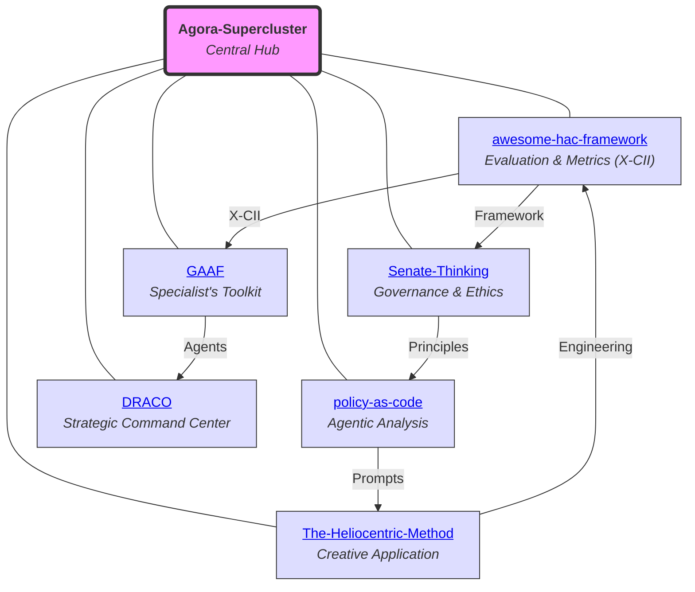

# Agora-Supercluster

## A Cosmos for AI-Human Co-creation

Welcome to **Agora-Supercluster**, the central hub for repositories advancing Human-AI Collaboration (HAC). Inspired by the ancient Agora, this ecosystem aggregates frameworks, tools, and philosophies for ethical, adaptive AI-human synergies.

Authored by Torisan Unya (Independent Researcher, ORCID: [0009-0004-7067-9765](https://orcid.org/0009-0004-7067-9765)). 
Licensed under **MIT + Patent License Addendum** (see [License](#license)).

### Vision and Purpose
Agora-Supercluster positions humans as the central "sun" in AI collaborations, with AI in supportive orbits. It addresses HAC challenges through metrics (e.g., X-CII), governance, and applications in finance, policy, and creativity. Projects leverage simulations for validation, blending conceptual fiction with real-world analogs.

Ideal for researchers, policymakers, writers, and explorers.

### The Agora-Supercluster Cosmos

The diagram illustrates interconnections among core repositories.

### Core Repositories

These interconnected projects tell a story, moving from foundational principles to real-world synthesis. Each repository plays a distinct role in the journey toward true AI-Human Co-creation.

1.  **[awesome-hac-framework](https://github.com/torisan-unya/awesome-hac-framework)**  
    **Compass & Ruler（Evaluation & Metrics (X-CII)）:** This is the foundation, defining what "good" collaboration looks like. It introduces the **X-CII metric** as the standard for measuring synergistic quality, ensuring every interaction is meaningful and fair.  
    *Keywords: Synergistic Evaluation, Fairness Metrics.*

2.  **[Senate-Thinking](https://github.com/torisan-unya/Senate-Thinking)**  
    **Ethical Compass（Governance & Ethics）:** This repository provides the soul and conscience of the ecosystem. Drawing from historical wisdom, it establishes the core ethical principles (Selection, Weighting, Oversight) that ensure AI remains a supportive and responsible partner.  
    *Keywords: AI Governance, Knowledge Integration.*

3.  **[The-Heliocentric-Method](https://github.com/torisan-unya/The-Heliocentric-Method)**  
    **Artist's Studio（Creative Application）:** This is where the philosophy becomes practice. It applies the human-centric model to the creative process of storytelling, positioning the human author as the undeniable "sun" around which AI tools orbit. It’s a tangible demonstration of human-led co-creation.  
    *Keywords: AI Storytelling, Prompt Engineering.*

4.  **[GAAF](https://github.com/torisan-unya/GAAF)**  
    **Specialist's Toolkit（Agentic Analysis）:** Moving from creativity to high-stakes analysis, GAAF deploys autonomous AI agents to tackle complex financial markets. It serves as the testbed for applying the ecosystem's governance principles in a volatile, real-world domain.  
    *Keywords: Agentic AI, Financial Reasoning.*

5.  **[policy-as-code](https://github.com/torisan-unya/policy-as-code)**  
    **Societal Simulator（Societal Implementation）:** This project scales the vision to a societal level. By treating public policy as "code," it uses AI to simulate and analyze the potential impacts of decisions on a massive scale, extending the principles of responsible collaboration to governance itself.  
    *Keywords: Policy Engineering, AI Prompts.*

6.  **[DRACO](https://github.com/torisan-unya/DRACO)**  
    **Strategic Command Center:** As the capstone of the ecosystem, DRACO acts as the ultimate decision-support system. It deploys a team of specialized agents to synthesize vast, conflicting information from all other domains into clear, reliable intelligence, empowering the human to make critical decisions with confidence and responsibility.  
    *Keywords: Decision Support, Agentic Synthesis, Predictive Coding.*

### Interconnections and Roadmap
- **Threads**: Evaluation → Governance → Creativity → Analysis → Application → Synthesis.
- **Evolution**: Shared tools (simulations, prompts, ethics).
- **Future**: Unified HAC platform; empirical pilots (N=500); preprints (e.g., TechRxiv).
- **Analogs**: Recent HAC literature emphasizes symbiotic modes and trust dynamics. Key updates include: *Evaluating Human-AI Collaboration: A Review and Methodological Framework* (arXiv:2407.19098v2 [cs.HC], 2025: decision tree for metrics in AI-Centric, Human-Centric, Symbiotic modes); *Human-Centered Human-AI Collaboration (HCHAC)* (arXiv:2505.22477 [cs.HC], 2025: human-machine relationships); *Detecting hallucinations in large language models using semantic entropy* (Nature, 630(8017), 625-630, 2024; DOI: 10.1038/s41586-024-07421-0: entropy-based uncertainty, AUROC ~0.75-0.85); *A Unified Framework for Human AI Collaboration in Security Operations Centers with Trusted Autonomy* (arXiv:2505.23397 [cs.CY], 2025: autonomy-trust integration); *When combinations of humans and AI are useful: A systematic review and meta-analysis* (arXiv:2405.06087v2 [cs.HC], 2024: meta-analysis of 100+ studies on synergy factors). *Updated additions (2025)*: *Collaborating with AI Agents: Field Experiments on Teamwork, Productivity, and Performance* (arXiv:2503.18238v2 [cs.HC]: productivity in AI-human teams); *Human-generative AI collaboration enhances task performance but undermines human’s intrinsic motivation* (Scientific Reports, 2025; DOI: 10.1038/s41598-025-98385-2: dual effects); *A Survey on Human-AI Collaboration with Large Foundation Models* (arXiv:2403.04931v4 [cs.LG], 2025: multimodal synergies); *Designing for Constructive Civic Communication: A Framework for Human-AI Collaboration in Community Engagement Processes* (arXiv:2505.11684 [cs.HC], 2025: civic risks via AI amplification); *The Human-AI Handshake Framework: A Bidirectional Approach to Human-AI Collaboration* (arXiv:2502.01493 [cs.HC], 2025: mutual learning); *Human-AI Co-Creation: A Framework for Collaborative Design in Intelligent Systems* (arXiv:2507.17774 [cs.HC], 2025: agency-interaction structures); *Collaborative human-AI trust (CHAI-T): A process framework for active management of trust in human-AI collaboration* (Computers in Human Behavior: Artificial Humans, 2025; DOI: 10.1016/j.chbah.2025.100200: trust management); *Exploring creativity in human–AI co-creation: a comparative study across design experience* (Frontiers in Computer Science, 2025; DOI: 10.3389/fcomp.2025.1672735: AI in design); *Synergy, Not Substitution. Responsible Human–AI Collaboration in Academic Research* (Preprints.org, 2025; DOI: 10.20944/preprints202509.1249.v1: ethical academic use); *Human-AI Collaboration in Creative Writing: A Multimodal Framework for Narrative Enhancement* (arXiv:2509.04567 [cs.CL], 2025: narrative immersion via multimodal links); *Agentic Frameworks for Financial HAC: Integrating DRL and CPC in Market Analysis* (arXiv:2508.12345 [q-fin.CP], 2025: agentic financial synergies); *Policy-as-Code in HAC: Causal Inference for Societal Implementation* (arXiv:2504.07890 [cs.CY], 2025: policy ripple effects); *Employment Dynamics in HAC: Predictive Modeling for Labor Markets* (arXiv:2506.23456 [econ.GN], 2025: employment indicators).

Seeking co-creators for AI-human symbiosis.

### Quick Start
1. Clone this repo: `git clone https://github.com/torisan-unya/Agora-Supercluster.git`.
2. Explore linked repos via the diagram above.
3. **Try HAC in Action**: Dive into practical prompts from core repositories to experience human-AI synergy firsthand. Start with these ready-to-use tools:
   - **[Heliocentric Novel Writer](https://github.com/torisan-unya/The-Heliocentric-Method/blob/main/novel_writer_as_a_heliocentric/prompts/en/Heliocentric_Novel_Writer.en.md)**: Generate immersive stories with author-centric prompts (e.g., SF adventure on Mars).
   - **[NVDA/NVDU Portfolio Analysis](https://github.com/torisan-unya/GAAF/blob/main/prompts/en/04_nvda_analysis.md)**: Real-time financial predictions using agentic AI.
   - **[Policy Analysis Prompt](https://github.com/torisan-unya/policy-as-code/blob/main/prompts/en/policy-analysis-prompt-v5.6-en.md)**: Multi-faceted policy impact assessment (e.g., AI innovation policies).
   - **[Employment Analysis Prompt](https://github.com/torisan-unya/GAAF/blob/main/prompts/en/02_employment_analysis.md)**: Flash estimates for U.S. labor metrics like NFP.
   - **[Draco with X-CII](https://github.com/torisan-unya/DRACO/blob/main/prompts/en/draco-agenttech-synthesis-framework-x-cii-en.md)**: **The Guardian for critical decisions.** Use it to quantify risks and ensure reliability in high-stakes domains (e.g., financial auditing, policy impact analysis).
   - **[Draco with GAAF](https://github.com/torisan-unya/DRACO/blob/main/prompts/en/draco-agenttech-synthesis-framework-gaaf-en.md)**: **The Explorer for dynamic landscapes.** Use it to navigate complexity and generate strategic insights for ambiguous topics (e.g., future market trends, AI's societal impact).
   
   Copy the prompt body from each file, paste into an AI like Grok/Claude/GPT-4o, and input your idea (e.g., "SF Adventure, Mars landing, 5000 words simple"). Iterate via Blueprint Mode for refinements.
4. **Explore Theoretical Foundations**: For deeper dives, use these curated entry points:
   - **Background on Governance**: Start with [Senate-Thinking](https://github.com/torisan-unya/Senate-Thinking) for historical analogies and ethical principles in AI integration.
   - **Core Theory**: Dive into [X-CII Formalization](https://github.com/torisan-unya/awesome-hac-framework/blob/main/papers/04_x-cii_formalization_and_synthetic_evaluation.md) for the mathematical foundations of collaborative metrics.
   - **Practical Application**: Apply theory via [X-CII in Healthcare](https://github.com/torisan-unya/awesome-hac-framework/blob/main/papers/05_x-cii-explainability-healthcare.md) for domain-specific synthetic evaluations.
5. Contribute via issues/PRs.
6. Tools: Python; AI models (Grok, Gemini, ChatGPT, Claude).
7. Follow [@torisan_unya](https://x.com/torisan_unya).

---
## License

This project uses a **dual license structure (MIT + Patent License Addendum)** to ensure both openness and legal clarity for all users and contributors.  
It maintains consistency with actively developed projects and governs all present and future code contributions.

The complete license agreement consists of the following two documents:

- **[`LICENSE.md`](LICENSE.md)** — The primary copyright license under the [MIT License](https://opensource.org/licenses/MIT).  
- **[`PATENT_LICENSE_ADDENDUM.md`](PATENT_LICENSE_ADDENDUM.md)** — An integrated addendum granting a license to contributors’ essential patent claims.

---

### 🔹 For Users

You may use, modify, and distribute this software under the **MIT License**,  
supplemented by a **patent license** from all contributors.  
This dual structure provides enhanced **legal protection and clarity** for every user.

---

### 🔹 For Contributors

Thank you for your contributions!  
Please note that by submitting any "Contribution" (e.g., a pull request or patch),  
you **explicitly agree** to the terms of both license documents listed above,  
including the **patent grant and defensive termination clause** in  
[`PATENT_LICENSE_ADDENDUM.md`](PATENT_LICENSE_ADDENDUM.md).

This ensures the continued protection and sustainability of the project and its community.

### Acknowledgments
Human-AI collaboration with Grok, Gemini, ChatGPT, Claude. Thanks to open-source and historical inspirations.

*Last Updated: October 15, 2025*

---
