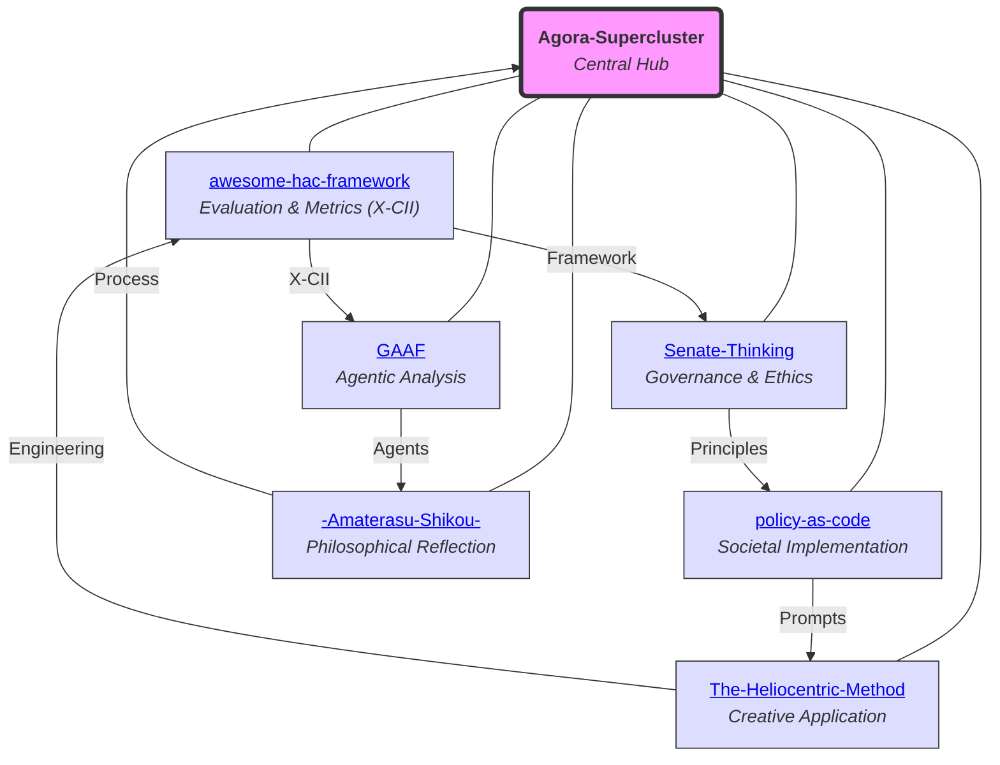

# Agora-Supercluster

## A Cosmos for AI-Human Co-creation

Welcome to **Agora-Supercluster**, the central hub for repositories advancing Human-AI Collaboration (HAC). Inspired by the ancient Agora, this ecosystem aggregates frameworks, tools, and philosophies for ethical, adaptive AI-human synergies.

Authored by Torisan Unya (Independent Researcher, ORCID: [0009-0004-7067-9765](https://orcid.org/0009-0004-7067-9765)). All content is under CC BY-SA 4.0, promoting open adaptation.

### Vision and Purpose
Agora-Supercluster positions humans as the central "sun" in AI collaborations, with AI in supportive orbits. It tackles HAC challenges via metrics (e.g., X-CII), governance, and applications in finance, policy, and creativity. Projects leverage simulations for validation, blending conceptual fiction with real-world analogs.

Ideal for researchers, policymakers, writers, and explorers.

### The Agora-Supercluster Cosmos

The diagram illustrates interconnections among core repositories.

### Core Repositories
Interconnected projects orbiting HAC themes:

1. **[awesome-hac-framework](https://github.com/torisan-unya/awesome-hac-framework)**  
   Curates HAC resources; introduces X-CII metric (Box-Cox aggregation of Q, E, S). Monte Carlo simulations (10,000 reps) yield median Relative X-CII: 107.5% [95% CI: 106.0-109.0%].  
   *Keywords: Synergistic Evaluation, Fairness Metrics.*

2. **[Senate-Thinking](https://github.com/torisan-unya/Senate-Thinking)**  
   Framework for AI governance via historical analogies (Roman Senate, Haudenosaunee). Proposes principles: Selection, Weighting, Oversight, Exclusion; ASC-MM model.  
   *Keywords: AI Governance, Knowledge Integration.*

3. **[The-Heliocentric-Method](https://github.com/torisan-unya/The-Heliocentric-Method)**  
   Author-centered AI storytelling; shifts from AI-centric to human-vision as "sun." Includes prompts for novel writing.  
   *Keywords: AI Storytelling, Prompt Engineering.*

4. **[GAAF](https://github.com/torisan-unya/GAAF)**  
   Self-evolving AI agents for financial analysis. Hierarchical architecture (CPC, ANN, GAN-DRL); applied to PCE, CPI, NVDA.  
   *Keywords: Agentic AI, Financial Reasoning.*

5. **[policy-as-code](https://github.com/torisan-unya/policy-as-code)**  
   Treats policies as code (Git-managed). AI prompts for analysis (e.g., aging population); promotes transparency via PRs.  
   *Keywords: Policy Engineering, AI Prompts.*

6. **[-Amaterasu-Shikou-](https://github.com/torisan-unya/-Amaterasu-Shikou-)**  
   Archive of human-AI co-thinking; records processes, failures. Structured: Foundation, Process, Cultivation.  
   *Keywords: Thought Records, AI Partnership.*

### Interconnections and Roadmap
- **Threads**: Evaluation → Governance → Creativity → Analysis → Application → Introspection.
- **Evolution**: Shared tools (simulations, prompts, ethics).
- **Future**: Unified HAC platform; empirical pilots (N=500); preprints (e.g., TechRxiv).
- **Analogs**: Evaluating Human-AI Collaboration: A Review and Methodological Framework (arXiv:2407.19098v2, 2025: proposes decision tree for metrics in AI-Centric, Human-Centric, Symbiotic modes); Human-Centered Human-AI Collaboration (HCHAC) (arXiv:2505.22477, 2025: emphasizes human-machine relationships); Detecting hallucinations in large language models using semantic entropy (Nature, 2024; DOI: 10.1038/s41586-024-07421-0: entropy-based uncertainty for hallucination detection, AUROC ~0.75-0.85); A Unified Framework for Human AI Collaboration in Security Operations Centers with Trusted Autonomy (arXiv:2505.23397, 2025: integrates autonomy, trust, human-in-the-loop); When combinations of humans and AI are useful: A systematic review and meta-analysis (arXiv:2405.06087v2, 2024: meta-analysis of 100+ studies on human-AI synergy factors). *Updated additions*: Collaborating with AI Agents: Field Experiments on Teamwork, Productivity, and Performance (arXiv:2503.18238v2, 2025: explores productivity in AI-human teams); Human-generative AI collaboration enhances task performance but undermines human’s intrinsic motivation (Scientific Reports, 2025; DOI: 10.1038/s41598-025-98385-2: dual effects on performance and motivation); A Survey on Human-AI Collaboration with Large Foundation Models (arXiv:2403.04931v4, 2025: overview of multimodal and preference-based synergies); Designing for Constructive Civic Communication: A Framework for Human-AI Collaboration in Community Engagement Processes (arXiv:2505.11684, 2025: addresses civic risks via AI amplification); The Human-AI Handshake Framework: A Bidirectional Approach to Human-AI Collaboration (arXiv:2502.01493, 2025: Handshake Model for mutual learning); Human-AI Co-Creation: A Framework for Collaborative Design in Intelligent Systems (arXiv:2507.17774, 2025: structures agency and interaction in intelligent systems); Collaborative human-AI trust (CHAI-T): A process framework for active management of trust in human-AI collaboration (Computers in Human Behavior: Artificial Humans, 2025; DOI: 10.1016/j.chbah.2025.100200: process framework for trust management); Exploring creativity in human–AI co-creation: a comparative study across design experience (Frontiers in Computer Science, 2025; DOI: 10.3389/fcomp.2025.1672735: comparative study on AI integration in design); Synergy, Not Substitution. Responsible Human–AI Collaboration in Academic Research (Preprints.org, 2025; DOI: 10.20944/preprints202509.1249.v1: unified framework for academic AI use with ethical focus).

Seeking co-creators for AI-human symbiosis.

### Quick Start
1. Clone this repo.
2. Explore linked repos.
3. Contribute via issues/PRs.
4. Tools: Python; AI models (Grok, Gemini, ChatGPT, Claude).
5. Follow [@torisan_unya](https://x.com/torisan_unya).

## License

This project is licensed under a combination of the MIT License and a patent license addendum. This structure provides legal clarity and protection for all users and contributors. The complete license agreement consists of the following two documents:

*   **[`LICENSE.md`](LICENSE.md)**: The primary copyright license (MIT License) governing the use of the software.
*   **[`PATENT_LICENSE_ADDENDUM.md`](PATENT_LICENSE_ADDENDUM.md)**: An integral addendum that grants a license to essential patent claims held by contributors.

### To Our Users

You are granted the right to use this software under the terms of the MIT License, supplemented by a patent license from all contributors, **providing enhanced legal protection and clarity** for all parties.

### To Our Contributors

Thank you for considering a contribution! Please be aware that by submitting any contribution (such as a pull request), you are explicitly agreeing to the terms of the entire license agreement, including the patent grant outlined in **[`PATENT_LICENSE_ADDENDUM.md`](PATENT_LICENSE_ADDENDUM.md)**. This is a crucial measure to protect the project, its community, and its future.

### Acknowledgments
Human-AI collaboration with Grok, Gemini, ChatGPT, Claude. Thanks to open-source and historical inspirations.

*Last Updated: October 10, 2025*

